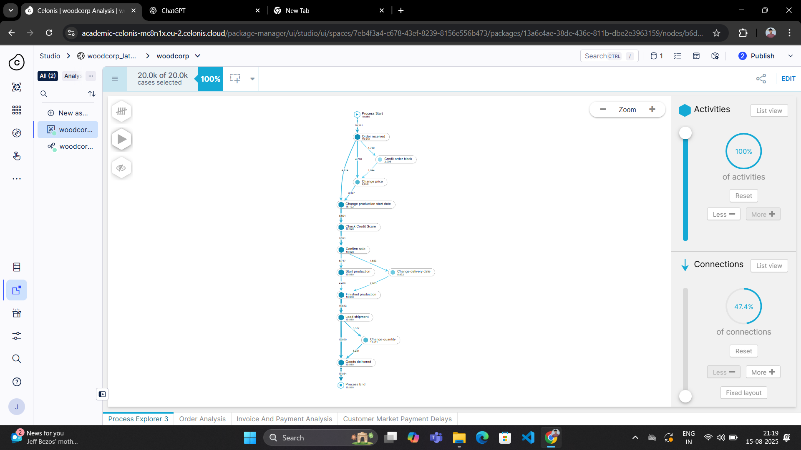
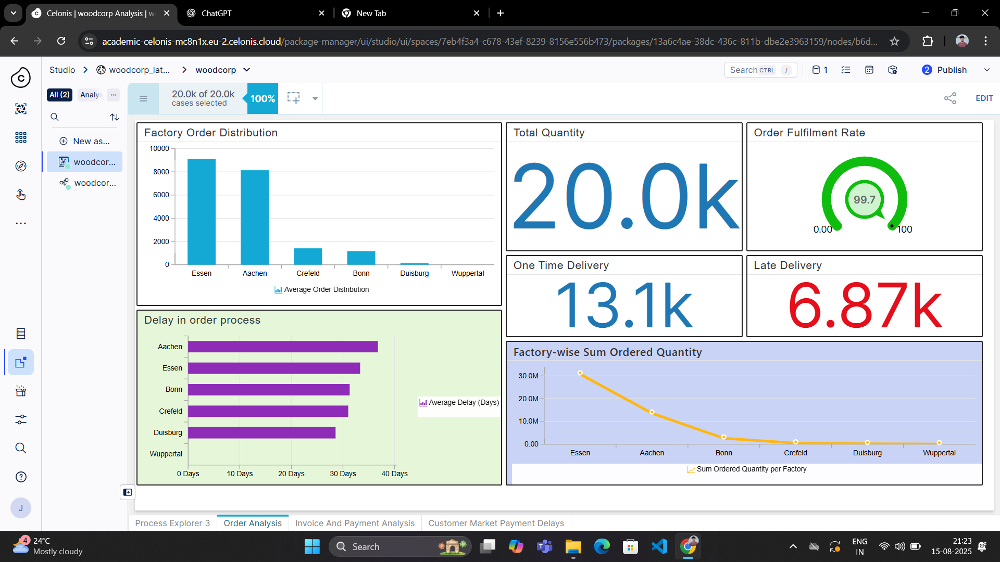
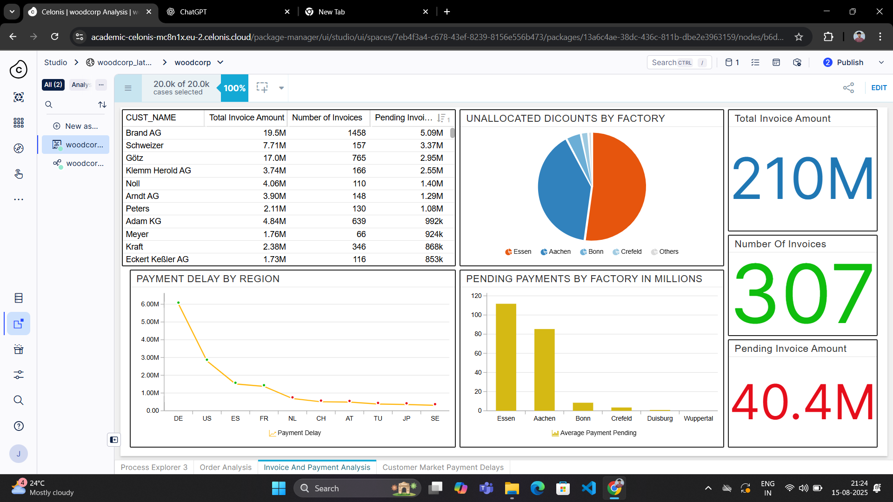
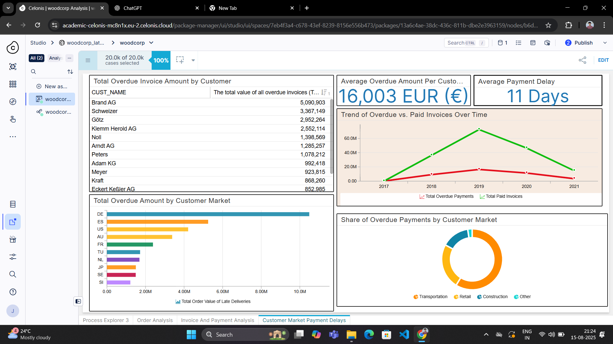

# 📊 Woodcorp O2C Data Analysis – Celonis Capstone Project

## 📌 Introduction
This project analyzes the **Order-to-Cash (O2C)** process of Woodcorp using **Celonis EMS**.  
The objective was to identify process bottlenecks, improve delivery efficiency, reduce overdue payments, and optimize resource allocation.

The dataset contains transactional records covering:
- **Order Processing**
- **Fulfillment**
- **Payment Tracking**

---

## 📂 Dataset Overview

### **Tables**
1. **O2C Activity Table** – Tracks order events with timestamps.
2. **O2C Case Table** – Contains order details, customer information, and financial data.

### **Common Fields**
- `CASE_KEY` – Unique order ID
- `EVENTTIME` – Timestamp of order events
- `ORDER_VALUE`, `UNIT_PRICE` – Financial metrics
- `DELIVERED_DATE`, `PROMISED_DATE` – Delivery schedule

### **Data Cleaning Steps**
- Removed duplicates
- Fixed missing or incomplete data
- Standardized formats
- Resolved delivery discrepancies
- Improved financial accuracy

---

## 🔍 Key Insights

### 1. **Delays in Order Processing**
- **Aachen & Essen** have the highest delays (~35 days).
- **Impact:** Customer dissatisfaction, cancellations, revenue loss.

### 2. **Factory Order Distribution**
- Orders are concentrated in **Aachen & Essen**, while **Duisburg & Wuppertal** are underutilized.
- **Impact:** Backlogs, errors, and wasted resources.

### 3. **Order Completion Time**
- **Wuppertal** has the highest completion time (~15,000+), **Crefeld** has the lowest.
- **Impact:** Slower fulfillment, higher operational costs.

### 4. **Delivery Performance**
- Total Orders: **20k**
- On-time Deliveries: **13.1k**
- Late Deliveries: **6.87k**

### 5. **Financial Performance**
- Total Invoice Amount: **€210M**
- Pending Invoices: **€40.4M**
- Number of Invoices: **307**
- Average Payment Delay: **11 Days**

---

## 📊 Dashboards

### **Process Explorer**

### **Order Analysis**

### **Invoice & Payment Analysis**

### **Customer Market Payment Delays**

---

## 🛠 Tools & Technologies
- **Celonis EMS** – Process Mining & Analysis
- **Excel / SQL** – Data preprocessing
- **PowerPoint** – Presentation preparation

---

## 📈 Recommendations
1. Distribute workload evenly among factories to avoid overloading Aachen & Essen.
2. Investigate operational issues in Aachen and Essen causing delays.
3. Optimize underutilized factories like Duisburg & Wuppertal.
4. Strengthen payment follow-up processes to reduce overdue invoices.
5. Implement automation for faster order processing.

---

## 👨‍💻 Contributors
- **Joshua Kuriakose**  
- **Bebinto Thomas**  
- **Shivaani K**  
- **Efin Rijo**  

---

## 📎 Project File
- [📄 Woodcorp Capstone PDF](woodcorp_capstone.pdf)

---
